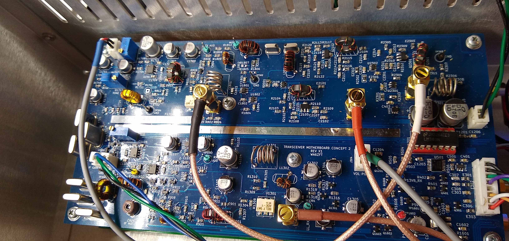

# Lefty-MOBO
Lefty Double Conversion Transceiver Motherboard

This is an HF Motherboard consisting of the entire signal chain from RF in to Speaker, and from Microphone to RF out.  A double conversion topology was chosen to allow the motherboard to operate on all HF bands with minimal intermodulation products close to the operating frequency.

The design uses 5 AS169-73 Skyworks RF switches,  3 Mini Circuits ADE-1 mixers, a pair 45.1 MHz matched Golledge 15 KHz BW IF filters, 6 matched 12.288 MHz crystals for the second IF SSB filter, and 3 2SC3357 low noise RF transistors in the 45.1 MHz "transverter" section. The speaker amplifier is an LM380.

This design was inspired from W7ZOI's single conversion "Lichen" Transceiver originally published in EMRFD. I use the dual JFET IF amplifer, AGC circuit, 3 transistor post-detector audio amplifier, and TX speech amplifier from that design in this design.

Please note that this is not a complete Transceiver system. The transceiver board will additionally require a 3 output VFO (My implementation uses one SI5351, and may use 2 of them in the future so that I can drive all the Mixers at 8mA) ,  external bandpass filter bank, an RF power amplifier, and a TX low pass filter bank.

Mixer 1 (U801) serves as a downconverter in RX mode, and a balanced modulator TX mode. This converts the 45.1 MHz first IF to 12.288 MHz second IF. In TX mode, the VFO provides the carrier frequency (which depends on the characteristics of the crystal filter)

Mixer 2 (U1301) serves as the product detector in RX mode, and a 12.288 MHz upconverter in TX mode.

Mixer 3 (U2201) provides downconversion from the 45.1 MHz first IF to the desired HF band.

Mixer 1, The first IF amplifier, and Mixer 2 operate in the same direction for both TX and RX, but the mixers change function depending upon whether they're being used in TX or RX. A pair of AS169-73 RF switches, some RF chokes and RF traps are used to select the TX mode, and to filter out RF from getting into the audio stages.

The 45.1 MHz first IF uses the "BITx" concept with 2SC3357 bidirectional amplifiers i.e. left-to-right, and right-to-left controlled by a pair of AS169-73 RF switches, and the P13V8_RX and P13V8_TX power rails. The 2SC3357's are biased for 40mA operation.

After Mixer3 there is a stage of TX RF amplification using a 2SC3357 to bring up the signal level what is required for the RF power amplifier (not included on this board). This amplifier is bypassed in RX mode using a AS169-73.

All control to the Lefty Motherboard is done over I2C using an NXP PCA9554 at 7 bit address 0x38. This allows the wiring from the Motherboard to be minimal. 
The I2C interface allows control AS169-73 RF switches, PTT, Rx Audio Mute circuit, AGC on/off, and the TX tune audio oscillator. The SCL and SDA pins at the connector operate at 3.3V and are intended to be used with newer 3.3V microcontrollers available such as the STM32 "black pill".

There is an I2C EEPROM on the board to facilitate storing the TX gain values for each band, and crystal filter 6dB points and bandwidth, and a DAC which is used to control the 12.288 MHz IF amplifier's gain in TX to help flatten out the TX power across all bands. TX gain may also be set manually by removing the DAC and and installing a 20K pot at R918. 

The PCB design was done with KiCAD 5.0. The BOM files are in .csv format and are included in the top level directory. There is a combined BOM, separate top and bottom SMT BOM's, and a PTH BOM.

The gerber files are in the directory TRX_MB_C2_X1

